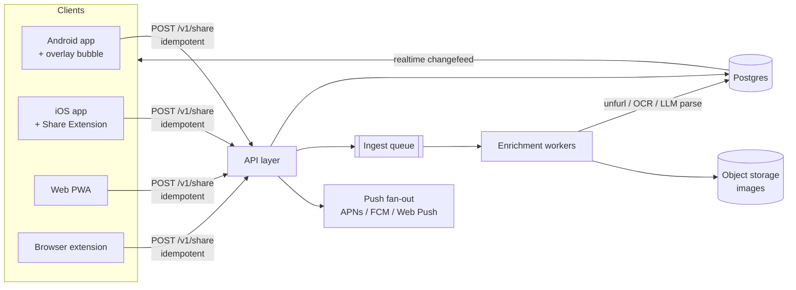
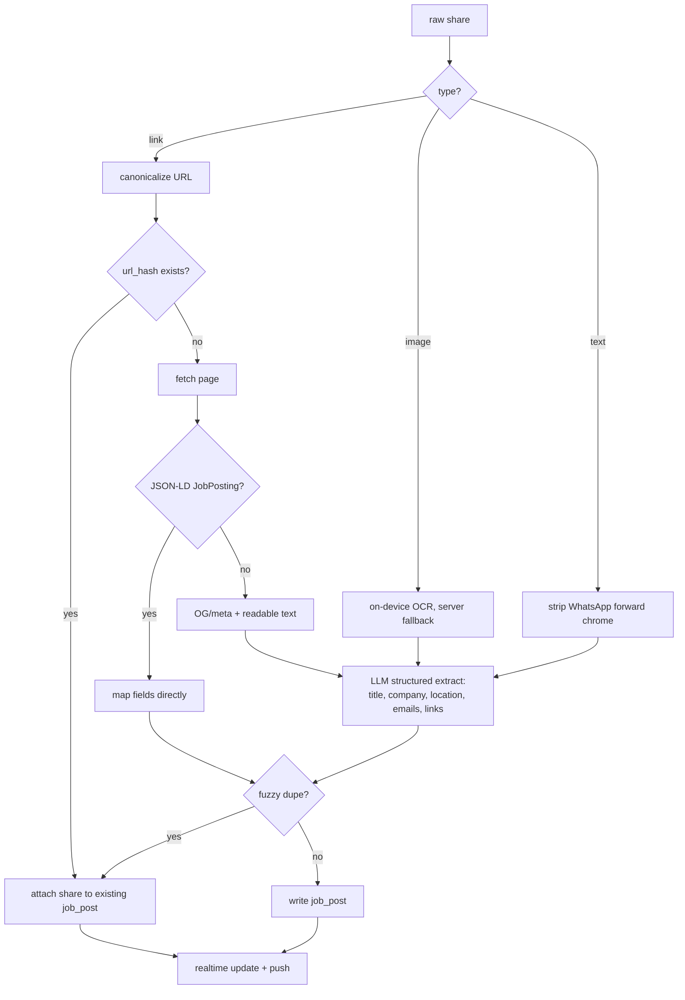

# Doc 1 — Job Sharing App & Website (Phase 1)

Working name: **JobDrop**
Status: **M0-M3 built** — foundations, groups and chat, the share pipeline, and the
native capture surfaces. M4 (image/OCR shares) is next.
See [doc 5](05-native-capture.md) for what in M3 is verified and what is not.
Branch: `claude/job-sharing-app-emg6ye`

---

## 1. The problem, stated precisely

A friend circle of 5–30 people is job hunting at the same time. Everybody finds roles the
other people would want. Today those roles move over WhatsApp and LinkedIn DMs, which
fails in three specific ways:

1. **Fan-out cost.** Sharing one job with eight people is eight actions. After a month of
   hunting, nobody pays that cost anymore, so sharing quietly stops.
2. **No memory.** A job posted in a WhatsApp group is gone in two days. You cannot answer
   "what did Rohan send me last week for backend roles in Bangalore?"
3. **No tracking.** You cannot tell which of the 60 links you were sent you already
   applied to. So you re-apply, or skip good ones, or lose the HR email you needed.

The product is a fix for exactly these three. Everything else is secondary.

**The single metric that matters:** time and gesture count from "I am looking at a job
posting" to "all my friends have it." Target: **one gesture, under 5 seconds, without
leaving the app I'm in.** If we lose that, there is no reason to use this over WhatsApp.

## 2. Scope

### In scope for v1

- Auth (Google + Apple). Phone OTP was dropped from v1: it needs a paid SMS provider and
  Indian DLT registration before _anyone_ can log in, whereas Google and Apple are free and
  work day one. Apple is included because App Store review requires it once Google is
  offered. Phone can be added later without a migration.
- Groups: create, invite, join by link/code, leave. A user can be in many groups.
- **Broadcast share**: one action sends a job to **all groups the user is in**. No group
  picker in the default path. (Selective targeting is v1.1 — see §12.)
- Three share types: **link**, **image** (screenshot of a JD), **text** (pasted JD, often
  containing an HR email).
- Group chat: every share lands as a message; users can also send plain text messages and
  reply to a share.
- 1:1 messages **behind approval** — you must accept a connection request before someone
  can DM you. Group invites likewise require acceptance.
- Automatic enrichment: unfurl links, OCR images, parse JD text, extract **emails**,
  company, role title, location.
- Deduplication: the same job shared twice shows as one card ("also shared by Ankit").
- Per-user tracking: mark a job `saved / applied / interviewing / rejected / not for me`.
- A **Jobs view** separate from chat: all jobs from all groups, searchable and filterable.
- Push notifications, batched sensibly (see §9).
- Web app with full parity, because people browse jobs on a laptop.

### Explicitly out of scope for v1

- The application agent (Doc 2).
- Resume storage/parsing.
- Public/discoverable groups, follower graph, feed ranking.
- Company pages, salary data, referral tracking.
- Voice/video, media galleries, stickers. This is not a chat app; chat is the thin layer
  around sharing.
- Threads, per-message read receipts, typing indicators. (Read state is per-group only.)

### Non-goals worth naming

We are not trying to beat LinkedIn at discovery. We are the layer _after_ discovery. The
user has already found the job; our only job is to move it to their friends and remember
it for them.

## 3. Users and their jobs-to-be-done

| Persona                                                               | What they do                   | What they need                                           |
| --------------------------------------------------------------------- | ------------------------------ | -------------------------------------------------------- |
| **The sharer** (the heavy user, ~20% of the group, sends 80% of jobs) | Sees 30 roles/week, shares 10  | Zero-friction capture. Must not require opening the app. |
| **The lurker**                                                        | Shares rarely, consumes daily  | Good digest, search, "is this still open?", tracking     |
| **The reciprocator**                                                  | Shares what they get asked for | Reply/react in-context, low notification noise           |

Design bias: **optimize brutally for the sharer.** If sharing is not effortless the group
starves and the lurkers churn. The reading experience can be merely good.

## 4. The capture surfaces — the core of the product

This is the part that decides whether the app succeeds. The ask was a floating bubble
(Whisper Flow style) you can drag/drop or paste a link onto, from anywhere in the OS.

### 4.1 Platform reality check

**This is achievable on Android, and not achievable on iOS.** iOS does not allow an app to
draw a persistent floating window over other apps — there is no equivalent of Android's
`SYSTEM_ALERT_WINDOW`, and apps that try are rejected. Apps like Whisper Flow that behave
"floating" on iOS are either using the keyboard slot, a Share Sheet extension, or the
Dynamic Island/Live Activity, none of which is a free-floating draggable target.

So the design is **one concept, two implementations**, and we make the iOS path feel as
close to one gesture as the OS permits:

| Surface                                                        | Android                                                                                                                                   | iOS                                                                                                                                                                                         | Web                                                                                                                                                                                  |
| -------------------------------------------------------------- | ----------------------------------------------------------------------------------------------------------------------------------------- | ------------------------------------------------------------------------------------------------------------------------------------------------------------------------------------------- | ------------------------------------------------------------------------------------------------------------------------------------------------------------------------------------ |
| **Floating bubble** (drag link onto it, or long-press → paste) | ✅ Foreground service + `SYSTEM_ALERT_WINDOW` overlay. Accepts OS drag-and-drop (`DragEvent` with `ClipData`) and tap-to-paste-clipboard. | ❌ Not possible.                                                                                                                                                                            | ❌                                                                                                                                                                                   |
| **Share sheet target** — "Share → JobDrop"                     | ✅ `ACTION_SEND` intent filter for text/image                                                                                             | ✅ **Share Extension** — this is the primary iOS path. Renders a 120pt sheet that has already sent by the time it appears; single "Undo" affordance.                                        | ✅ Web Share Target API for installed PWA (Android Chrome only)                                                                                                                      |
| **System shortcut**                                            | ✅ Quick Settings tile, home-screen widget                                                                                                | ✅ **Action Button** (15 Pro+), **Back Tap** double-tap, Control Center control (iOS 18+), all via an App Intent / Shortcut that grabs the clipboard and sends                              | —                                                                                                                                                                                    |
| **Clipboard assist on open**                                   | ✅ Read clipboard on foreground, offer "Send this link?" banner                                                                           | ⚠️ iOS shows a paste-permission prompt for clipboard reads. Use `UIPasteControl` — a system Paste button the user taps once, no prompt — as a big "Paste & Send" target on the home screen. | ✅ `navigator.clipboard.readText()` on user gesture                                                                                                                                  |
| **Browser**                                                    | —                                                                                                                                         | —                                                                                                                                                                                           | ✅ Chrome/Edge/Firefox **extension**: right-click → "Send to JobDrop", plus `Ctrl+Shift+J` on the current tab. This is how desktop sharing should work; the PWA alone is not enough. |

**The honest framing to the user:** on Android you get the bubble you described; on iOS you
get a two-tap share-sheet flow plus a one-press Action Button/Back Tap flow, which is the
closest the platform allows. That difference should be designed for, not apologized for —
the iOS extension must be so fast (send immediately, show a 1-second confirmation, allow
undo) that it feels like one gesture.

### 4.2 The bubble's behavior (Android)

- Persistent foreground service, ~48dp circle, docks to nearest screen edge, remembers
  position, snaps out of the way, dimmed to 40% opacity after 3s idle.
- **Drag a link/image onto it** → sends immediately.
- **Tap it** → reads clipboard; if it holds a URL or >200 chars of text, shows a one-line
  preview chip and a Send button. If clipboard is empty/irrelevant, opens the app.
- **Long-press** → expands to a small panel: paste box + "send to all groups" toggle +
  recent 3 groups (v1.1 targeting hook).
- **Drag to bottom** → dismiss for 4 hours (do not make it hard to get rid of; a bubble
  the user can't kill gets uninstalled).
- Battery/permission reality: `SYSTEM_ALERT_WINDOW` requires a settings-screen grant, and
  Chinese OEM skins (MIUI, ColorOS, Funtouch) aggressively kill overlay services. Ship a
  guided permission flow, detect the OEM, deep-link to the right autostart settings page,
  and **make the share-sheet path work identically** so the bubble is a bonus, not a
  dependency.

### 4.3 What happens after the gesture — the latency budget

The user must never wait on the network. The share is committed locally and optimistically
fanned out; enrichment happens after and mutates the card in place.

```
t=0ms      gesture (drop / share-sheet / paste)
t<50ms     write to local queue (SQLite / IndexedDB), haptic tick
t<150ms    optimistic message rendered in every group, UI says "Sent"
t<300ms    surface dismisses itself — user is back in their app
--- async, may take seconds, may be offline and retried later ---
t+1-4s     server ingests, canonicalizes URL, dedupes, unfurls OG data
t+2-10s    OCR / LLM parse completes; card upgrades from bare link → rich job card
```

Rules that fall out of this:

- **Never block the send on enrichment.** A card with just a URL is a valid, complete send.
- **The queue is durable.** Offline shares survive app kill and send later. Show a subtle
  "3 pending" chip rather than an error.
- **Idempotency.** Every share carries a client-generated `client_share_id` (UUID). Retries
  and double-taps collapse server-side.

## 5. UX principles and screens

### 5.1 Principles

1. **One primary action per screen.** The composer's default is "send to everyone." Any
   choice we ask for is a tax on the thing we're selling.
2. **Progressive disclosure of richness.** Card starts plain, becomes rich. No spinners
   larger than a favicon.
3. **The list, not the scrollback, is the product.** Chat is where sharing feels social;
   the Jobs tab is where it becomes useful. Both must be first-class.
4. **Never lose a paste.** Anything the user drops is stored raw even if parsing fails
   completely. A failed parse degrades to "a text message with a link in it," never to an
   error.
5. **Notification restraint.** This app will be uninstalled the day it notifies 40 times.
   See §9.

### 5.2 Screens (mobile)

**Tab 1 — Feed (default).** Unified reverse-chronological stream of jobs from all groups,
not per-group. Each row is a job card: company logo/favicon, role, company, location,
work-mode chip, "via Ankit in _2024 Grads_", age, and a status pill. Swipe right = save,
swipe left = not for me. Tapping the card opens the job detail; tapping the group name
opens that group's chat.

Rationale: a per-group inbox forces the reader to visit N groups. Most people are in 2–4
groups with heavy overlap. The feed is the honest default; groups are how you _post_ and
_discuss_, not how you _read_.

**Tab 2 — Groups.** List of groups with unread counts. Group screen is a chat: shares
render as job cards, plain messages as bubbles, replies inline. Composer has a paste-first
input and a `+` for image/text-JD.

**Tab 3 — Tracker.** The user's own jobs by status — `Saved / Applied / Interviewing /
Rejected`, as a list with a segmented control (a kanban board is nicer on web, worse on
mobile). Each entry keeps the apply link and the HR email, one tap to copy or mail.
This directly answers "which of these did I already apply to?"

**Tab 4 — You.** Profile, connections/requests, groups, notification prefs, capture-surface
setup (bubble permission, share-extension how-to, browser extension link).

**Job detail sheet.** Title, company, location, salary if parsed, apply button (URL or
`mailto:` with the extracted HR email prefilled), full JD text (scrollable, from OCR or
paste), original image if any, "shared by X in Y (+2 others)", per-user status control,
and the discussion thread for that job aggregated across groups.

**Composer / share confirmation.** Deliberately minimal: preview chip, "Sending to all 4
groups", optional one-line note ("this one's remote, Pratham"), Send. The note field is
worth keeping — context is why WhatsApp shares are useful.

### 5.3 Web

Same information architecture, three-column on desktop: groups rail | feed/chat | job
detail. Two things the web build should do _better_ than mobile:

- **Tracker as a real board** with drag between columns and CSV export.
- **Bulk triage**: keyboard-driven (`j/k` to move, `s` save, `x` dismiss, `a` mark applied,
  `/` search). Power users clear a week of backlog in two minutes.

Web is a PWA (installable, push via Web Push) plus the browser extension for capture.

## 6. Architecture



### 6.1 Stack recommendation

| Layer               | Choice                                                                                                                 | Why                                                                                                                                                               |
| ------------------- | ---------------------------------------------------------------------------------------------------------------------- | ----------------------------------------------------------------------------------------------------------------------------------------------------------------- |
| Mobile + web client | **Expo / React Native + TypeScript** (single codebase → iOS, Android, Web)                                             | See §6.2 — this supersedes the Flutter recommendation this doc originally carried.                                                                                |
| Native bits         | Kotlin (overlay service, share intent), Swift (Share Extension, App Intent) via Expo native modules and config plugins | Unavoidable — these are the capture surfaces and they are inherently native.                                                                                      |
| Backend             | **Supabase** (Postgres + Auth + Realtime + Storage + Edge Functions)                                                   | Auth, row-level security, realtime subscriptions and file storage without building four services. Postgres means we are not locked into a proprietary data model. |
| Queue/workers       | Postgres-backed queue (`pgmq` or a simple `SKIP LOCKED` table) + a small Node/Python worker on Fly.io or Railway       | Enrichment is bursty and low-volume; a separate broker is overkill at this size.                                                                                  |
| Link unfurl         | Self-hosted fetch + OG/JSON-LD parse; `schema.org/JobPosting` when present                                             | Most boards emit JobPosting JSON-LD — free structured data.                                                                                                       |
| OCR                 | On-device **ML Kit** (Android) / **Vision** (iOS) first, server fallback                                               | Free, instant, private. Server OCR only when the client can't.                                                                                                    |
| JD understanding    | Claude (`claude-sonnet-5` for volume, `claude-opus-5` for hard parses) on the extracted text                           | Turns messy OCR/WhatsApp-forward text into structured fields reliably; regex alone fails on real-world JDs.                                                       |
| Push                | FCM (Android + Web) and APNs (iOS)                                                                                     | —                                                                                                                                                                 |

If Supabase is rejected later, the escape hatch is plain Postgres + a NestJS API; the
schema below is portable.

### 6.2 Why Expo, and the Flutter call this replaces

This doc originally recommended Flutter. That was reconsidered before any code was written,
and the deciding argument was not UI quality — it was iOS build machinery and the Share
Extension.

- **iOS builds need macOS.** EAS Build compiles iOS in the cloud, so a solo developer
  without a Mac can still ship. Flutter would mean buying a Mac or renting Codemagic.
- **`expo-share-intent` already implements the iOS Share Extension** and the Android
  `ACTION_SEND` intent as a maintained Expo module. That is the single hardest piece of
  Phase 1, and it is the difference between a week of Swift and an afternoon of config.
- **The bubble was never a differentiator.** An Android overlay is a foreground service
  inflating a view through `WindowManager` — Kotlin under Flutter, React Native or native
  alike. No framework makes it easier, so it should not have influenced the choice.

What Flutter would have given up in exchange is real: finer pixel control and a single
rendering model across platforms. For a product whose value is a two-second gesture rather
than a bespoke interface, the build pipeline mattered more.

Expect roughly 15–20% of the mobile effort to be native platform code regardless of
framework.

## 7. Data model

```sql
-- identity
users(id uuid pk, phone text unique, email text, handle text unique,
      display_name text, avatar_url text, created_at timestamptz)

devices(id uuid pk, user_id fk, platform text, push_token text,
        app_version text, last_seen_at timestamptz)

-- social graph
groups(id uuid pk, name text, avatar_url text, created_by fk,
       join_code text unique, created_at timestamptz)

group_members(group_id fk, user_id fk, role text check in ('admin','member'),
              joined_at timestamptz, muted_until timestamptz,
              primary key (group_id, user_id))

group_invites(id uuid pk, group_id fk, inviter_id fk, invitee_id fk null,
              status text check in ('pending','accepted','declined','revoked'),
              created_at, responded_at)

-- DMs require mutual approval before any message can be sent
connections(id uuid pk, requester_id fk, addressee_id fk,
            status text check in ('pending','accepted','blocked'),
            created_at, responded_at,
            unique (least(requester_id,addressee_id), greatest(...)))

dm_threads(id uuid pk, user_a fk, user_b fk, connection_id fk, created_at)

-- messaging
messages(id uuid pk,
         group_id fk null, thread_id fk null,   -- exactly one is non-null
         sender_id fk, kind text check in ('text','job','system'),
         body text null,                        -- note or plain message
         job_post_id fk null,
         client_msg_id uuid,                    -- idempotency
         created_at, edited_at, deleted_at,
         unique (sender_id, client_msg_id))

reactions(message_id fk, user_id fk, emoji text, primary key(message_id,user_id,emoji))

read_state(user_id fk, group_id fk, last_read_at timestamptz,
           primary key(user_id, group_id))

-- the job entity: one row per real-world job, shared many times
job_posts(id uuid pk,
          source_type text check in ('link','image','text'),
          raw_input text,              -- always kept, even if parsing fails
          canonical_url text null,
          url_hash text null,          -- sha256(canonical_url), unique-ish
          content_hash text null,      -- for image/text dedupe
          title text, company text, location text,
          work_mode text check in ('onsite','hybrid','remote',null),
          employment_type text, experience_min int, experience_max int,
          salary_text text,
          apply_url text, apply_emails text[],   -- extracted HR/Gmail addresses
          description text,                       -- OCR'd or pasted JD
          og_image_url text, favicon_url text, source_site text,
          posted_at timestamptz null, closes_at timestamptz null,
          parse_status text check in ('pending','ok','partial','failed'),
          parse_meta jsonb, first_shared_by fk, created_at)

create unique index on job_posts(url_hash) where url_hash is not null;

job_attachments(id uuid pk, job_post_id fk, storage_path text,
                mime text, width int, height int, ocr_text text)

-- one row per (job, group) fan-out, so "who shared this where" is answerable
shares(id uuid pk, job_post_id fk, sharer_id fk, group_id fk,
       message_id fk, note text, client_share_id uuid, created_at,
       unique (sharer_id, client_share_id, group_id))

-- per-user application tracking — the retention feature
job_status(user_id fk, job_post_id fk,
           status text check in ('new','saved','applied','interviewing',
                                 'offer','rejected','not_interested'),
           applied_at timestamptz, notes text, updated_at,
           primary key(user_id, job_post_id))

-- durable server-side ingest work
ingest_jobs(id uuid pk, job_post_id fk, kind text, status text,
            attempts int, last_error text, run_after timestamptz, created_at)
```

### Access rules (RLS sketch)

- A user reads `messages` only for groups they're a member of, or DM threads they're party to.
- A user reads a `job_post` if any `share` of it targets a group they're in (or they created it).
- `job_status` is private to its owner — nobody sees what you applied to unless we
  explicitly build that later (see Doc 3, §privacy).
- DM insert is blocked unless an `accepted` connection exists. Enforce in the DB, not the client.

## 8. The ingestion pipeline



**URL canonicalization** is the highest-leverage 50 lines in the codebase. Strip
`utm_*`, `gclid`, `fbclid`, `trk`, `refId`, `trackingId`; lowercase host; drop `www.`;
drop trailing slash; then apply per-site rules:

- `linkedin.com/jobs/view/<id>` → keep only the id (LinkedIn appends huge tracking params
  and the same job arrives with five different URLs)
- `indeed.com` → keep `jk=`
- `naukri.com` → keep the job-id path segment
- Greenhouse/Lever/Ashby → strip everything after the token

**Email extraction** matters because a chunk of Indian hiring happens over Gmail/HR
addresses. Run a strict RFC-ish regex over OCR/JD text, drop obvious noise
(`noreply@`, `example@`, image-artifact garbage), keep them in `apply_emails[]`, and
surface a one-tap "Email your resume" button that opens `mailto:` with a subject line
prefilled from the role title. This field is also the seed for the agent in Doc 2 —
the email-apply path is the easiest thing to automate later.

**LinkedIn caveat:** LinkedIn job URLs are largely auth-walled to server-side fetchers, so
unfurling will often return a login page. Handle it: detect the wall, fall back to
(a) any OG tags that do survive, (b) asking the sharing client to pass the page title it
already has, (c) rendering the card from the URL alone. Do not build the product on the
assumption that link scraping works everywhere — it won't.

## 9. Notifications

The default that keeps people installed:

- **Instant push** only for: a DM, a reply to your share, a group invite/connection request.
- **Batched digest** for new jobs: at most one push per group per **hour**, worded as
  "3 new jobs in _2024 Grads_ — SDE-1 at Zeta, +2". A person sharing 8 jobs in a burst
  must produce one notification, not eight.
- **Daily digest** (default 9pm, configurable): "11 jobs today, 4 match backend/remote."
- Per-group mute, and a global "only digest" switch in onboarding — offered _before_ the
  first flood, not after.

## 10. Onboarding

The first-run sequence decides adoption. Five steps, none skippable-into-a-dead-end:

1. Google or Apple (10s).
2. Name + photo (prefilled from Google; skippable).
3. **Join or create a group** — deep link from an invite lands here directly, already
   filled in. An empty app is a dead app.
4. **Set up capture** — Android: overlay permission, with a 4-second animation showing the
   bubble catching a link. iOS: a "Try it now" that opens Safari to any job page and walks
   through Share → JobDrop, then offers the Back Tap / Action Button setup.
5. Notification preference (digest vs instant), then land on the group with a seeded
   system message explaining "drop links here, everyone gets them."

Invites: a `https://jobdrop.app/j/<code>` link, shareable on WhatsApp, that opens the app
if installed or the web app if not. Web app must be fully usable without installing
anything — that's the on-ramp.

## 11. Milestones

Estimates assume one focused developer; halve the calendar if two.

| #   | Milestone              | Contents                                                                                                                                | Est.   | Status   |
| --- | ---------------------- | --------------------------------------------------------------------------------------------------------------------------------------- | ------ | -------- |
| M0  | Foundations            | Repo/monorepo layout, Supabase schema + RLS with a test suite, auth (Google + Apple), app shell, CI                                     | 1.5 wk | **done** |
| M1  | Groups + chat          | Create/join/leave, invite links, group message list, realtime, read state, plain text messages                                          | 2 wk   | **done** |
| M2  | Share pipeline (links) | `POST /v1/share` with idempotency, broadcast fan-out to all groups, offline queue, canonicalization, unfurl worker, dedupe, job card UI | 2 wk   | **done** |
| M3  | Capture surfaces       | Android share-sheet intent + **overlay bubble**; iOS **Share Extension** + App Intent/Back Tap; web PWA share target                    | 2 wk   | **done** |
| M4  | Image + text JDs       | Upload/storage, on-device OCR, LLM structured extract, **email extraction**, mailto apply                                               | 1.5 wk |          |
| M5  | Feed + Tracker         | Unified feed, filters/search, per-user status, tracker screen, swipe actions                                                            | 1.5 wk |          |
| M6  | Notifications          | FCM/APNs/Web Push, digest batching, per-group prefs                                                                                     | 1 wk   |          |
| M7  | DMs + approvals        | Connection requests, approval gates, DM threads                                                                                         | 1 wk   |          |
| M8  | Web polish + beta      | Three-column desktop layout, keyboard triage, board view, browser extension, then ship to the actual friend circle                      | 2 wk   |          |

**M2 + M3 is the real product.** If time runs out, everything from M5 onward can slip; if
M3 slips, there is no product.

## 12. Deliberate v1.1 hooks

Built into the schema now, exposed in the UI later:

- **Selective targeting**: `shares` is already per-group, so "send to these 2 groups"
  needs UI only. Likely the bubble's long-press panel.
- **Smart routing**: infer relevant groups from the job's role/location and each group's
  history — "this looks like a data role, your _DS folks_ group wants it." Only after we
  have data.
- **"Still open?"** — re-fetch `apply_url` weekly, mark expired jobs, stop showing them.
- **Referral asks**: "anyone know someone at Zeta?" as a first-class message kind.
- **Import from WhatsApp**: paste an exported chat, extract every job link from it.

## 13. Risks

| Risk                                       | Severity                         | Mitigation                                                                                                                            |
| ------------------------------------------ | -------------------------------- | ------------------------------------------------------------------------------------------------------------------------------------- |
| iOS cannot do the floating bubble          | High — it's the headline feature | Make the Share Extension a genuinely one-tap send with undo; wire Action Button/Back Tap; set expectations in the doc and the UI copy |
| Android OEM skins kill the overlay service | High                             | OEM-aware permission flow, deep links to autostart settings, share-sheet path as full-featured fallback, watchdog restart             |
| LinkedIn/Naukri block server-side unfurl   | Medium                           | Client-supplied title fallback, degrade to bare link card, never error                                                                |
| OCR/LLM cost per share                     | Medium                           | On-device OCR first; batch LLM calls; cheap model by default, escalate only on low-confidence; cache by content hash                  |
| Cold start — nobody shares, group dies     | High                             | Seed the founding group manually, import a WhatsApp backlog, digest that shows _someone_ is active                                    |
| Notification fatigue → uninstall           | High                             | Digest-by-default (§9)                                                                                                                |
| Storage cost of screenshots                | Low                              | Compress to WebP ≤1600px, drop originals after 90 days keeping OCR text                                                               |
| Someone leaks a private group link         | Low                              | Rotatable join codes, admin approval toggle                                                                                           |

## 14. Open questions

1. **Group size** — is this 8 people or 80? Affects whether "broadcast to all groups" stays
   sane and whether we need any spam control. Assumption for now: ≤30 per group, ≤6 groups
   per user.
2. **Cross-group duplicate suppression on the reader's side** — if the same job lands in 3
   groups, the feed shows one card with "in 3 groups". Confirmed as the intent, but worth
   validating that people don't want to see each mention.
3. **Do we need iOS-first or Android-first?** The bubble works only on Android, and the
   friend circle is likely Android-majority. Recommendation: **Android + web first**, iOS in
   the same milestone but shipped a week later.
4. **Region/locale** — assuming India-centric (Naukri URL rules, HR-email applications).
   Say so if that's wrong; it changes URL rules and the email-apply emphasis.
5. **Name and domain.** `JobDrop` is a placeholder.
