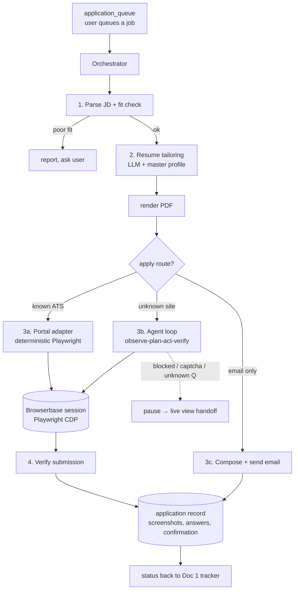

# Doc 2 — Job Application Agent (Phase 2)

Working name: **JobDrop Agent**
Status: planning only. Do not start until Doc 1 reaches M5.
Branch: `claude/job-application-agent` (separate from the app branch by design)

---

## 1. What it does

Given a job — a URL, or a JD with an HR email — the agent:

1. Reads and structures the posting (role, must-haves, keywords, location, seniority).
2. Decides whether the user is a plausible fit, and says so honestly if not.
3. **Tailors a resume** for that specific posting from the user's master profile, and
   renders it to PDF.
4. **Applies**: drives the portal in a real browser (Playwright on **Browserbase**), or
   sends a properly written email with the resume attached when the posting is
   email-only.
5. Records everything — screenshots, answers given, confirmation ID — and reports back.

It is a **looping agent**: observe → plan → act → verify, with a step budget, not a
hard-coded script per portal. Hard-coded adapters exist as a fast path for the four or
five portals that cover most postings; the loop is the fallback that handles the long tail.

## 2. Boundaries — decided up front

These are product constraints, not legal boilerplate. They shape the architecture.

- **The agent applies only to jobs the user explicitly queues.** No autonomous trawling
  and mass-applying. That produces garbage applications, burns the user's reputation, and
  is what gets tooling blocked.
- **Never fabricates.** Tailoring means reordering, re-emphasizing and rewording _true_
  content from the master profile. If a JD asks for a skill the user doesn't have, the
  agent does not invent it; it flags the gap in the fit report.
- **Never answers legally-significant questions on its own** — work authorization,
  sponsorship, visa status, disability, veteran status, criminal history, notice period,
  expected CTC. These come from an explicit, user-filled answer bank or the run pauses.
- **Portal terms matter.** Greenhouse/Lever/Ashby/Workday direct applications are ordinary
  form submissions and fine to automate for yourself. **LinkedIn Easy Apply automation
  violates LinkedIn's user agreement and risks the user's account** — build it last, behind
  an explicit warning, or not at all. The recommended default is: ATS portals + email
  applications, and for LinkedIn just deep-link the human.
- **CAPTCHA is a stop sign, not an obstacle.** On CAPTCHA, bot-wall, or login-required, the
  run pauses and hands the live browser session to the user. No solving services.
- **Rate limits**: max N applications/day/user (default 15), with jitter and human-like
  pacing — not to evade detection but because a burst of 60 identical applications is both
  a red flag and bad strategy.

## 3. Architecture



### 3.1 Components

| Component           | Choice                                                                                                                  | Notes                                                                                                                                    |
| ------------------- | ----------------------------------------------------------------------------------------------------------------------- | ---------------------------------------------------------------------------------------------------------------------------------------- |
| Orchestration       | **LangGraph** (Python) or a hand-rolled state machine                                                                   | A durable, resumable graph matters more than the framework. Each node checkpoints so a run can pause for a human and resume hours later. |
| Reasoning           | Claude — `claude-opus-5` for planning/tailoring, `claude-sonnet-5` for per-step DOM decisions                           | Per-step calls dominate cost; keep them on the cheaper model with the expensive one reserved for the plan and the resume.                |
| Browser             | **Browserbase** (hosted, stealth-configured Chrome, session recording, live view URL) driven by **Playwright over CDP** | Live view is what makes human handoff possible. Session recording is the audit trail.                                                    |
| Page representation | Accessibility tree + trimmed DOM, not raw HTML; screenshot only when the text representation is ambiguous               | Raw HTML blows the context window and makes the model worse, not better.                                                                 |
| Resume rendering    | Structured JSON → Typst or LaTeX → PDF (deterministic), **not** LLM-generated layout                                    | ATS parsers care about structure; a template you control is testable.                                                                    |
| Storage             | Postgres (shared with Doc 1) + object storage for PDFs/screenshots                                                      |                                                                                                                                          |
| Queue               | Same Postgres queue pattern as Doc 1                                                                                    |                                                                                                                                          |

### 3.2 The loop, concretely

```
state = { goal, job, resume_path, answer_bank, page, history, step, budget }

while step < budget and not done:
    obs   = snapshot(page)          # a11y tree + URL + visible errors + form fields
    plan  = llm.decide(goal, obs, history, answer_bank)
        # -> one of: fill(field, value) | click(selector) | upload(field, file)
        #            | select(field, option) | scroll | wait_for(condition)
        #            | ask_human(question) | done(confirmation) | give_up(reason)
    if plan.needs_unknown_answer: -> pause, ask_human, checkpoint, exit
    result = execute(plan)          # Playwright, with a per-action timeout
    history.append(obs.digest, plan, result)
    verify(result)                  # did the DOM change as predicted? if not, re-plan
```

Guardrails on the loop:

- **Step budget** (default 40) and wall-clock budget (default 6 min). Exceeding it is a
  failed run, not an infinite retry.
- **No destructive actions.** Whitelist of allowed action types; never click "delete",
  never navigate off-domain without a reason, never submit twice.
- **Submit is a distinct, gated step.** Before the final submit the agent produces a
  summary of every field it filled. In `review` mode (the default for a user's first 5
  runs) this is shown to the user for approval; in `auto` mode it's logged and submitted.
- **Verification is mandatory.** A run is `submitted` only on positive evidence:
  confirmation page text, confirmation email, URL change to a known success pattern, or
  application-status API. Otherwise it is `uncertain` and the user is told exactly that.
- **Self-healing over brittle selectors.** Adapters try their known selectors first; on
  failure they fall back to the generic loop rather than erroring.

## 4. Resume tailoring

The most valuable part, and the part most likely to be done badly.

**Master profile** (filled once, editable): work history with raw achievement bullets,
projects, education, skills with proficiency, links, and a set of "proof points" —
numbers the user can actually defend.

**Per-application pipeline:**

1. Extract from the JD: required skills, preferred skills, seniority signals, domain,
   and the literal keyword vocabulary the ATS will match on.
2. Score fit: `must-have coverage %`, missing items listed explicitly.
3. Select and reorder: pick the 3–5 most relevant experiences/projects; reorder bullets so
   the top two in each block map to the JD's top requirements.
4. Rewrite bullets in the JD's vocabulary **without changing the facts** — if the user
   wrote "made the API faster" and has the number, it becomes "cut p95 latency 340ms→90ms
   on the orders API (Go, Postgres)". If there's no number, it does not get one.
5. Render to a single-page (fresher) or two-page ATS-safe PDF: single column, real text,
   no tables/graphics/icons in the parse path, standard section headings.
6. **Diff gate**: every generated claim must trace to a master-profile fact. A validator
   rejects the resume if a skill appears that isn't in the profile. This is the anti-
   hallucination backstop and it should be a hard failure, not a warning.

Store every generated resume version against the application — when an interview call
comes, the user needs to know which resume the interviewer is holding.

## 5. Answer bank

Portals ask the same 30 questions forever. Fill once, reuse:

- Identity/contact, location, willingness to relocate
- Work authorization, sponsorship need, visa status _(user-entered, never inferred)_
- Notice period, current CTC, expected CTC _(sensitive; per-application override)_
- Years of experience per skill
- "Why this company?" — generated per application from the JD + company page, then cached
- Demographic/EEO questions — **default to "decline to answer"** unless the user set a value
- Gaps, reason for leaving, references

Unknown question → `ask_human`, and the answer is written back to the bank so it's never
asked twice. This is what makes application #20 take 30 seconds instead of 5 minutes.

## 6. Data model additions

```sql
profiles(user_id fk pk, master_json jsonb, updated_at)        -- source of truth for facts
resume_versions(id pk, user_id fk, application_id fk null,
                json jsonb, pdf_path text, template text,
                model text, created_at)

answer_bank(user_id fk, key text, value text, sensitive bool,
            source text check in ('user','generated','inferred'),
            updated_at, primary key(user_id, key))

applications(id pk, user_id fk, job_post_id fk,              -- job_post_id ← Doc 1
             route text check in ('ats','generic','email','manual'),
             portal text, mode text check in ('review','auto'),
             status text check in ('queued','running','needs_human',
                                   'submitted','uncertain','failed','skipped'),
             fit_score numeric, fit_report jsonb,
             resume_version_id fk, confirmation_ref text,
             browserbase_session_id text, replay_url text,
             started_at, finished_at, error text)

application_events(id pk, application_id fk, step int, kind text,
                   action jsonb, observation_digest text,
                   screenshot_path text, created_at)

portal_adapters(id pk, host_pattern text, name text, version int,
                config jsonb, success_rate numeric, last_verified_at)
```

`applications.job_post_id` pointing at Doc 1's `job_posts` table is the single most
important integration decision — see Doc 3.

## 7. Portal adapters

Deterministic fast paths, ordered by expected coverage:

1. **Greenhouse** — stable DOM, predictable field names. Highest ROI.
2. **Lever** — same.
3. **Ashby** — same.
4. **Workday** — account creation per company, multi-page, genuinely painful; big win when
   it works because humans hate it most.
5. **Email apply** — no browser at all. Uses `apply_emails[]` extracted in Doc 1.
6. **Generic loop** — everything else.

Each adapter is `{ detect(url|dom), fill(profile, answers, resume), submit(), verify() }`
plus a recorded fixture page so adapters have regression tests that don't hit the network.
Track `success_rate` per adapter and auto-demote to the generic loop when it drops.

## 8. Email-apply path

Straightforward and high-value for the India-centric case where a JD carries an HR Gmail:

- Compose a short, specific email (subject: `Application — <Role> — <Name>`), 5–7 lines,
  referencing one concrete thing from the JD.
- Attach the tailored PDF, named `Firstname_Lastname_Role.pdf`.
- Send via the **user's own** Gmail with OAuth (so it lands in their Sent and replies come
  to them) — never from a shared app address, which would land in spam and detach the
  conversation from the user.
- **Always show the draft before the first send.** After N approved sends, offer auto-send.
- Log `message_id` so a reply can later be matched back to the application.

## 9. Milestones

| #   | Milestone               | Contents                                                                                            | Est.   |
| --- | ----------------------- | --------------------------------------------------------------------------------------------------- | ------ |
| A0  | Harness                 | Browserbase + Playwright session mgmt, a11y snapshotting, action executor, event log, replay viewer | 1.5 wk |
| A1  | Profile + resume engine | Master profile schema, tailoring pipeline, Typst/LaTeX template, PDF render, fact-trace validator   | 2 wk   |
| A2  | Email apply             | Gmail OAuth, composer, attachment, draft-approval UI                                                | 1 wk   |
| A3  | Agent loop              | Plan/act/verify loop, budgets, `ask_human` pause + resume, review-before-submit                     | 2 wk   |
| A4  | Adapters                | Greenhouse, Lever, Ashby + fixture tests                                                            | 1.5 wk |
| A5  | Workday                 | Account handling, multi-page state                                                                  | 1 wk   |
| A6  | Ops                     | Rate limits, cost tracking, success metrics, failure triage dashboard                               | 1 wk   |

## 10. What "working" means

- **Submission rate**: ≥85% of queued ATS applications reach `submitted` without human help.
- **Zero fabrications**: the fact-trace validator never lets an unbacked claim through.
  Measured by sampling 20 resumes/week manually. This is a hard gate, not a KPI.
- **Cost**: < ₹15 per application all-in (LLM + Browserbase minutes).
- **Time**: < 3 min wall clock per application.
- **Human escalations**: < 1 in 5 after the answer bank is warm.

## 11. Risks

| Risk                                                | Mitigation                                                                                             |
| --------------------------------------------------- | ------------------------------------------------------------------------------------------------------ |
| Portals change DOM constantly                       | Adapters are a fast path only; generic loop is the floor. Fixture tests catch drift.                   |
| Bot detection blocks the run                        | Browserbase stealth defaults; human-like pacing; on block → pause and hand off, never escalate evasion |
| LLM fills a field wrong and the user doesn't notice | `review` mode by default; full field summary logged; screenshots per step                              |
| LinkedIn account risk                               | Don't automate LinkedIn Easy Apply by default; deep-link the human instead                             |
| Applications get worse, not better, at volume       | Fit-score gate — refuse to apply below a threshold, and tell the user why                              |
| Cost blowup from loops                              | Hard step/time/₹ budgets per run, per-day caps                                                         |
| Sensitive data (CTC, phone, address) in logs        | Redact from event logs; encrypt answer-bank rows marked `sensitive`                                    |
